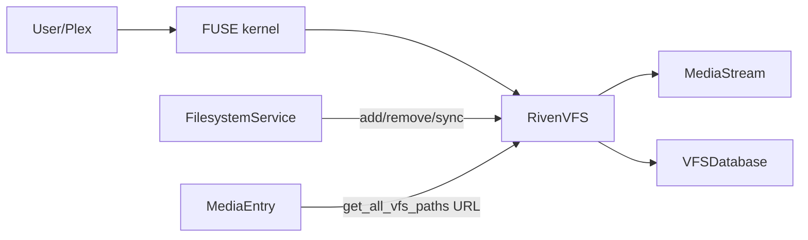

# VFS (Virtual File System)

FUSE-based virtual filesystem that exposes media files as a directory tree. Files are not stored on disk; reads are streamed from debrid providers via HTTP range requests so media servers (Plex, Jellyfin, etc.) or players see a normal directory.

---

## Overview

- **What it is**: FUSE-based virtual filesystem (pyfuse3) that exposes media files as a directory tree under a mount path. Files are not stored on disk; reads are streamed from debrid providers (Real-Debrid, AllDebrid, etc.) via HTTP range requests.
- **Why**: Lets media servers (Plex, Jellyfin, etc.) or players see a normal directory; Riven resolves paths to provider URLs and serves data on demand with optional chunk caching.

---

## Architecture

- **RivenVFS** (`program/services/filesystem/vfs/rivenvfs.py`): Implements `pyfuse3.Operations`. Owns mount lifecycle, in-memory VFS tree, and FUSE handlers (lookup, getattr, readdir, open, read).
- **FilesystemService** (`program/services/filesystem/filesystem_service.py`): Runner that owns `riven_vfs` and calls `riven_vfs.add(item)` / reinit/sync. It is the "filesystem" / symlinker step in the pipeline.
- **Mount lifecycle**: `_prepare_mountpoint()` (kill stale mounts, create dir) → `pyfuse3.init()` + `pyfuse3.main()` in a Trio loop → on shutdown `close()` requests unmount and cleanup. Mount path comes from settings `filesystem.mount_path`.

---

## Data model

- **FilesystemEntry** (base), **MediaEntry** (video: `original_filename`, `download_url`, `unrestricted_url`, `provider`, `library_profiles`, `media_metadata`), **SubtitleEntry** (parent video, language, content in DB). Stored in SQLite; `available_in_vfs` marks whether currently registered in the VFS tree.
- **VFS tree**: In-memory only. **VFSRoot** → **VFSDirectory** (e.g. `movies`, `shows`, profile prefixes) → **VFSFile** (name, inode, `original_filename`, `file_size`, `entry_type`). Tree is rebuilt or updated on sync/add/remove; no DB for tree structure.
- **VFSDatabase** (`program/services/filesystem/vfs/db.py`): Resolves URL for a given entry (unrestrict if needed), fetches subtitle content by parent filename + language. Used by RivenVFS when opening/reading.

---

## Path generation

- **Single source of truth**: `program/services/filesystem/vfs/naming.py` `generate_clean_path(item, original_filename)` plus **MediaEntry.get_all_vfs_paths()** (`program/media/media_entry.py`).
- **Base paths**: Every item gets at least one path: `/movies/Title (Year)/Title.mkv` or `/shows/Show Name/Season X/Show Name - S0XE0X - Episode Title.mkv` (templates from settings: `movie_dir_template`, `show_dir_template`, etc.).
- **Library profiles**: Optional extra paths. Settings `filesystem.library_profiles` define filters (genres, ratings, is_anime, etc.) and a `library_path` (e.g. `/kids`, `/anime`). If an entry's `library_profiles` list contains a profile key, the same canonical path is also exposed under that prefix (e.g. `/anime/movies/...`). So one file can appear in multiple "libraries."
- **Matching**: On full sync, **LibraryProfileMatcher** re-matches all MediaEntries to current profiles and updates `library_profiles`; then VFS tree is cleared and all entries re-registered.

---

## Pipeline integration

- **When files appear**: After **Downloader** sets state to **Downloaded**, **state_transition** submits the item to **FilesystemService** (`program/state_transition.py`). **FilesystemService.run()** expands to leaf items (episodes/movies) and calls **riven_vfs.add(episode_or_movie)** for each. **add()** registers the item's MediaEntry and its SubtitleEntry(s) in the tree and sets `available_in_vfs = True`. Item is then considered **Symlinked** when it has a filesystem entry available in VFS.
- **When files disappear**: Item **reset** or **remove** clears or deletes MediaEntry/Subtitles and calls **riven_vfs.remove(item)** so nodes are removed and empty dirs pruned; `available_in_vfs` set false.
- **Sync**: **Full sync** (item=None): re-match all entries to library profiles, clear tree, re-register all. Used at RivenVFS init and when settings change (e.g. profile list). **Individual sync** (item set): remove then add that item (e.g. after subtitle add or metadata change).

---

## Open and read flow

- **open(inode)**: Resolve inode → VFSFile; for `entry_type == "media"` optionally validate/refresh CDN URL (DebridCDNUrl); create file handle and return it. Read-only.
- **read(fh, off, size)**: Resolve fh → inode → VFSFile. Two branches:
  - **Subtitle**: `original_filename` format `subtitle:{parent_original_filename}:{language}`. Content read from **VFSDatabase.get_subtitle_content()** (DB), cached in handle for that fh.
  - **Media**: **MediaStream** is used. It fetches data in chunks (configurable size, e.g. 32 MiB), supports range requests to the provider, and uses a shared **Cache** (chunk cache) keyed by `original_filename`. Reads are satisfied from cache when possible, else HTTP request; sequential reads can trigger prefetch. Timeouts and retries are handled inside the streaming layer.
- **Cache**: Chunk cache lives on disk under `filesystem.cache_dir`, size limit `cache_max_size_mb`, eviction LRU or TTL. Cache is shared across streams; **Cache** is injected (di) and used by the streaming/chunker layer. **vfs_stats** API returns `streams` (opener stats) and `cache` (cache metrics).

---

## Settings reference

- **filesystem.mount_path**: Where to mount the VFS.
- **filesystem.library_profiles**: Dict of profile key → LibraryProfile (name, library_path, enabled, filter_rules). Drives extra VFS paths.
- **filesystem.cache_dir**, **cache_max_size_mb**, **cache_ttl_seconds**, **cache_eviction**, **cache_metrics**: Chunk cache behavior.
- **filesystem.movie_dir_template**, **show_dir_template**, etc.: Naming templates for path generation (variables: title, year, season, episode, resolution, codec, …).
- **stream.*** (chunk_size_mb, timeouts): Used by MediaStream.

---

## API endpoints

- **GET /api/v1/mount**: Lists filenames and absolute paths under the mount (scandir). See [api-default.md](api-default.md).
- **GET /api/v1/vfs_stats**: Returns active stream stats and cache metrics. See [api-default.md](api-default.md).
